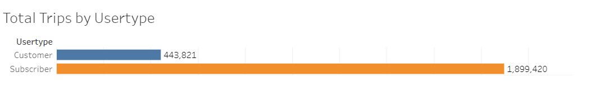

# bikesharing

## Overview of Analysis:

The purpose of this project is to explain visually the benefits of beginning a CitiBike Program in Des Moines, IA using the visualization tool Tableau. Tableau is the industry standard for creating high end easy to read data visualizations. The Data provided is from CitiBike based on statistics from the program in New York and contains data from August 2019. This data should be all we need to figure out what to expect if we were to extend the program to Des Moines.

 

[Link to the Tableau Story](https://public.tableau.com/app/profile/oscar.delgado7063/viz/CitiBikesDesMoines/CitiBikeDesMoines)

 

## Results:

There is a lot we can learn from the data provided by CitiBike and that's not surprising since there's <b>a lot</b> of data. In August 2019 there are more than 2 million total trips.

 

 

These trips are broken down in numerous ways throughout the data. First and foremost by usertypes (Customer and Subscribers).

 

 

As you can see, the subscribers account for many more trips than the non-subscribing customers. This data would make a great deal of sense seeing as how most commuters who use the service would likely be subscribers. This can also be broken down by the number of trips made based on age groups. The data here seems as though riders age 50 may be an anomaly given their surprising share of rides. This may be a default age given to riders who do not share their age information.

 

 

Trip duration required some additional steps to complete, but it has been completed and can provide us some additional insight into bike usage. In order to retrieve this information we had to employ the help of Python to calculate DateTime and extract the data. 

 
[NYC_CityBike_Challenge.ipynb](./Data/NYC_CityBike_Challenge.ipynb)
 

 

 