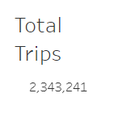
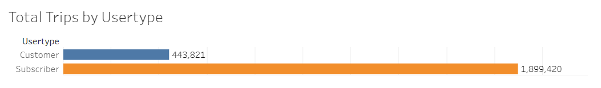
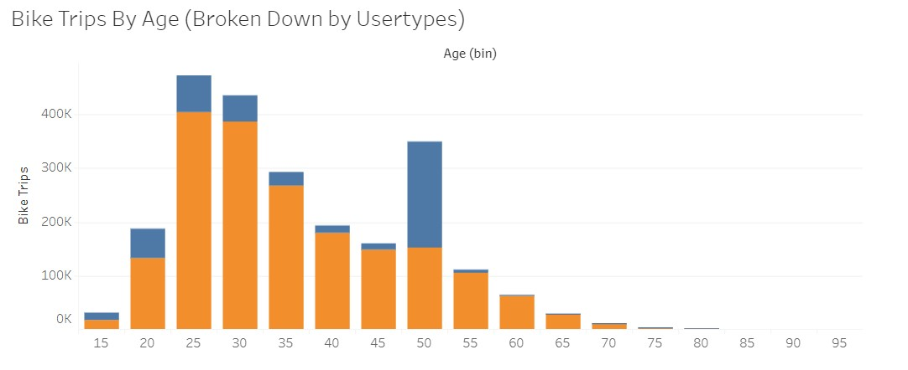
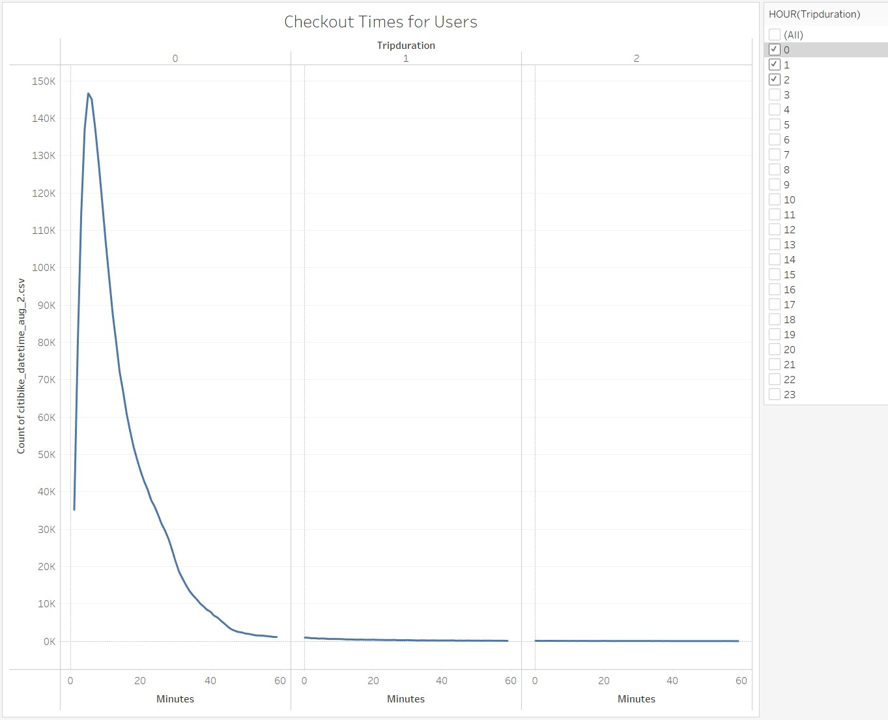
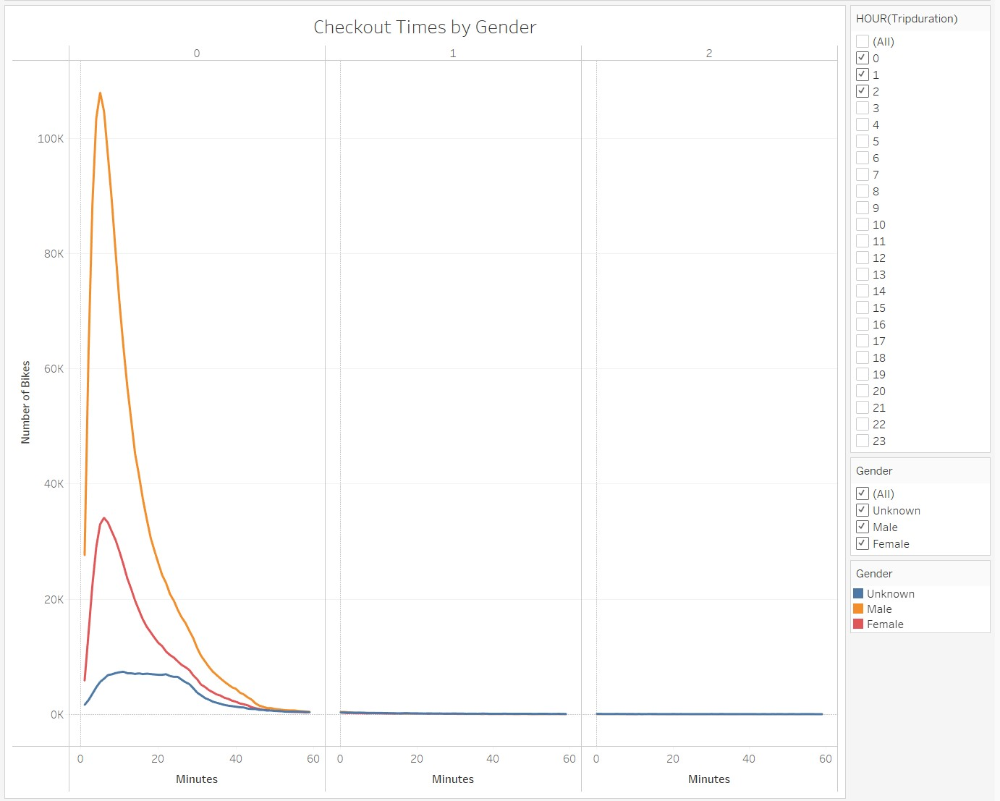
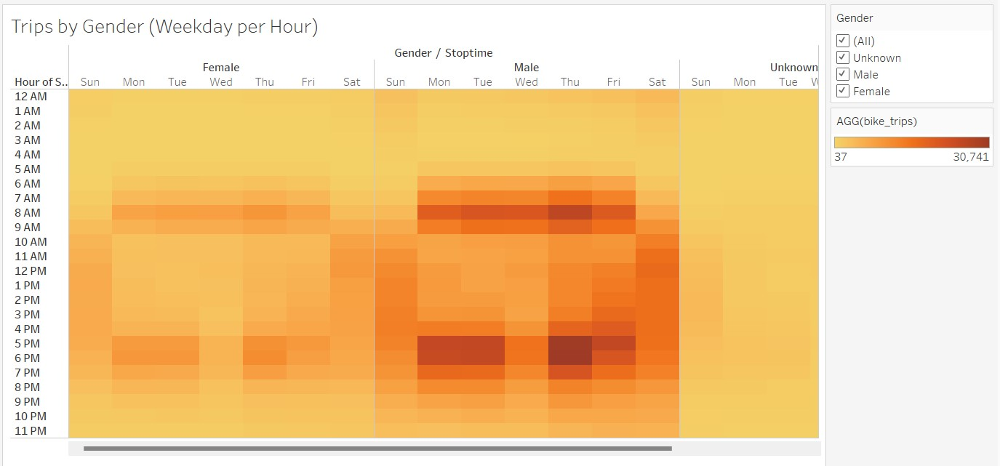
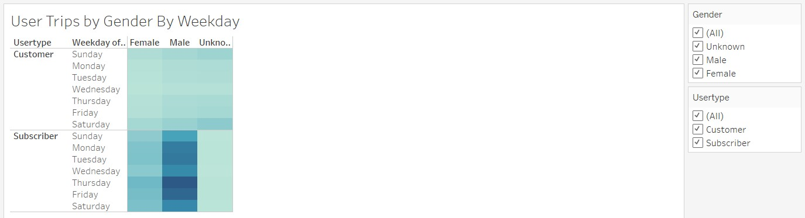

# bikesharing

## Overview of Analysis:

The purpose of this project is to explain visually the benefits of beginning a CitiBike Program in Des Moines, IA using the visualization tool Tableau. Tableau is the industry standard for creating high end easy to read data visualizations. The Data provided is from CitiBike based on statistics from the program in New York and contains data from August 2019. This data should be all we need to figure out what to expect if we were to extend the program to Des Moines.

 

[Link to the Tableau Story](https://public.tableau.com/app/profile/oscar.delgado7063/viz/CitiBikesDesMoines/CitiBikeDesMoines)

 

## Results:

There is a lot we can learn from the data provided by CitiBike and that's not surprising since there's <b>a lot</b> of data. In August 2019 there are more than 2 million total trips.

 

 

These trips are broken down in numerous ways throughout the data. First and foremost by usertypes (Customer and Subscribers).

 

 

As you can see, the subscribers account for many more trips than the non-subscribing customers. This data would make a great deal of sense seeing as how most commuters who use the service would likely be subscribers. This can also be broken down by the number of trips made based on age groups. The data here seems as though riders age 50 may be an anomaly given their surprising share of rides. This may be a default age given to riders who do not share their age information.

 

 

Trip duration required some additional steps to complete, but it has been completed and can provide us some additional insight into bike usage. In order to retrieve this information we had to employ the help of Python to calculate DateTime and extract the data. The most common trip duration appears to be about 5 minutes.

 

[NYC_CityBike_Challenge.ipynb](./Data/NYC_CityBike_Challenge.ipynb)

 

 

 

Another piece of the puzzle was to examine the most popular times of day and days of the week to travel using CitiBike. The data conclude Monday through Friday bikes are checked out primarily in the morning and in the evening. The times would suggest that these are commuters as the time ranges are between 7am and 10am and between 4pm and 9pm. The weekend trips are primarily between 9am and 9pm on Saturday and 11am and 7pm on Sundays.

 

 

Finally, the last piece of data was regarding gender. Here there is a great deal of information to examine: duration based on gender, the most popular days of the week and time based on gender and trips by usertype based on gender. Based on the latest information the gender gap is fairly narrow in Des Moines with women outnumbering men by about 3%. The below data speaks for itself.

 

 

 

 

 

 

## Summary

In conclussion, the concept of adding a CitiBike program to Des Moines, IA is a complicated decission. There is no guarantee that it will generate the type of success as New York and additional research may be needed. I recommend that there be a bar graph comparing the weather in New York to the weather in Des Moines to compare the climates as that may change the data and rates of usage. I also recommend creating a map and charting out potential start and drop off areas for the bikes as the cities' layout may be different and not as bike friendly.

Please find below links to the Python file and Tableau Story Page:

[NYC_CityBike_Challenge.ipynb](./Data/NYC_CityBike_Challenge.ipynb)

[Link to the Tableau Story](https://public.tableau.com/app/profile/oscar.delgado7063/viz/CitiBikesDesMoines/CitiBikeDesMoines)

